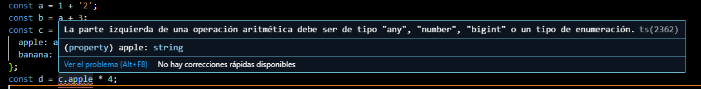
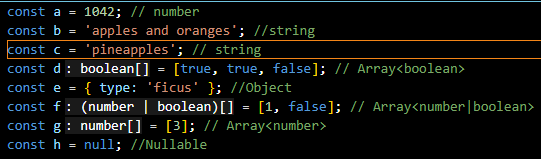

## Modifica el código para conseguir que aparezca una línea roja de error en el IDE avisándote de que se está disparando un TypeError.

## code1.ts
```
const a = 1 + '2';
```



Al convertir a string el 2 en la constante a da error porque ya no puede realizar la operación aritmética. 

## code2.ts y code3.ts

1. Para cada uno de los valores del fichero code2.ts, ¿Qué tipo de datos inferirá TypeScript? Explica por qué se ha inferido este tipo de datos.



Se infieros estos tipos de datos por las declaraciones que tienen, por ejemplo la constante `a` al  ser inicializada con un numero typescript asume que sera de tipo number.

2. ¿Por qué se dispara cada uno de los errores del fichero code3.ts?

- Error TS2588 : Cannot assign to 'i' because it is a constant.ts(2588)': es que no se puede cambiar el valor de 'i' porque se ha definido como una constante.
- Error TS2345: Argument of type '"5"' is not assignable to parameter of type 'number': se ha definido la variable 'j' como array de numeros, por lo que '5' no se puede insertar al ser un string.
- Error TSTS2322: Type '4' is not assignable to type 'never': porque no puede ocurrir nunca que la variable 'k' tenga valor.
- Error TS2571: Object is of type 'unknown': Porque a la variable 'l' no se le ha especificado un tipo por lo que no se pueden hacer operaciones directas con ella.

3. ¿Cuál es la diferencia entre una clase y una interface en TypeScript?

La principal direncia es que una interfaz solo se define como la estructura de un objeto, proporcionando propiedades y métodos y no pueden ser instanciadas mientras que una clase se tiene que definir y puede implementar sus métodos, pueden heredarse de otras clases y se pueden instanciar.